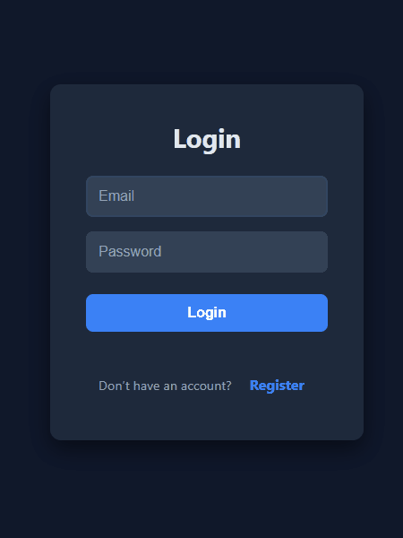
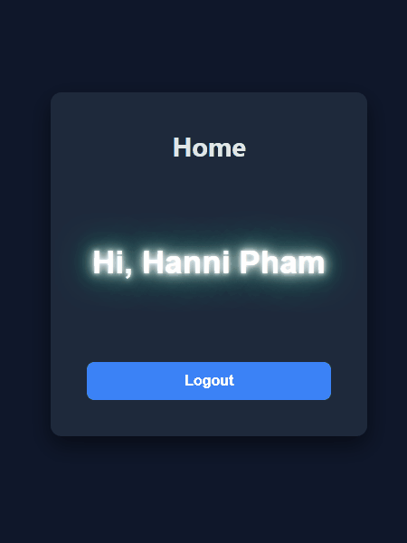
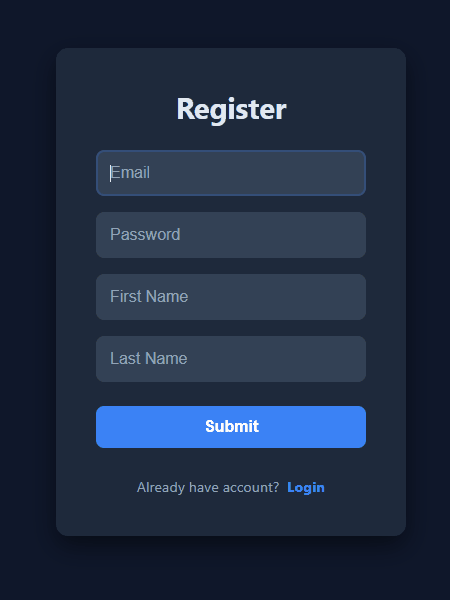

# Fullstack Chat App 💬

A real-time chat application built with a modern tech stack, focusing on performance, security, and a seamless user experience.

---

## 📸 Visual Demos

### User Authentication Flow
| Registration | Login | Logout |
| :---: | :---: | :---: |
|  |  |  |

### Error Handling & Validation
| Registration Errors | Login Errors |
| :---: | :---: |
|  |  |

### Real-time Messaging
| Sender Perspective | Receiver Perspective |
| :---: | :---: |
|  |  |

### Overall Chat Experience


---

## 🚀 Features

- **Secure Authentication**: JWT-based authentication for secure user sessions.
- **User Management**: Sign up, log in, and log out with real-time validation and feedback.
- **Responsive Design**: Modern UI built with React 19 and Vanilla CSS for a smooth across-device experience.
- **Persistent Storage**: Backend powered by .NET 10 and Dapper, ensuring efficient data operations with SQL Server/Azure SQL.
- **Interactive API Documentation**: Fully integrated Swagger (OpenAPI) for easy backend exploration.

---

## 🛠️ Tech Stack

### Frontend
- **Framework**: [React 19](https://react.dev/)
- **Build Tool**: [Vite 8](https://vitejs.dev/)
- **Styling**: Vanilla CSS
- **Linting**: ESLint

### Backend
- **Framework**: [.NET 10 Web API](https://dotnet.microsoft.com/)
- **Data Access**: [Dapper](https://github.com/DapperLib/Dapper)
- **Database**: [Microsoft SQL Server](https://www.microsoft.com/en-us/sql-server) / [Azure SQL](https://azure.microsoft.com/en-us/products/azure-sql)
- **Authentication**: [JWT Bearer Tokens](https://jwt.io/)
- **API Docs**: [Swashbuckle / Swagger](https://swagger.io/)

---

## 🏗️ Project Structure

```text
fullstack-my-chat-app/
├── api/          # .NET 10 Web API Backend
├── frontend/     # React 19 + Vite Frontend
└── assets/       # Visual demo assets and images
```

---

## 🏁 Getting Started

### Prerequisites
- [.NET 10 SDK](https://dotnet.microsoft.com/download/dotnet/10.0)
- [Node.js (LTS)](https://nodejs.org/)
- [SQL Server](https://www.microsoft.com/en-us/sql-server/sql-server-downloads) or an Azure SQL instance

### Backend Setup
1. Navigate to the `api` folder:
   ```bash
   cd api
   ```
2. Configure your connection string in `appsettings.json` (or use User Secrets).
3. Run the application:
   ```bash
   dotnet run
   ```

### Frontend Setup
1. Navigate to the `frontend` folder:
   ```bash
   cd frontend
   ```
2. Install dependencies:
   ```bash
   npm install
   ```
3. Run the development server:
   ```bash
   npm run dev
   ```

---

## 🏗️ Development Progress
- [x] Initial Project Setup
- [x] User Authentication (API & UI)
- [x] JWT Integration
- [x] Real-time Messaging Implementation
- [x] Message History Optimization
- [x] User Profile Customization